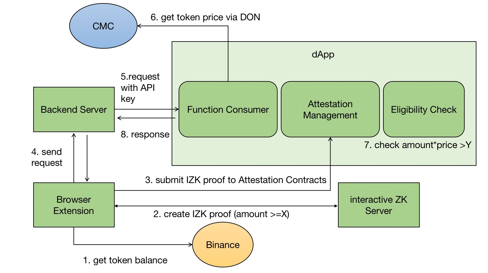

# Chainlink-Demo-Server

## Demo Overview



This is a demo code base for the Chainlink Hackathon. In general, a user can use this extension to retrieve his token amount from a CEX and prove that its value is greater than X. This proof will be submitted to the smart contract via the [EAS](https://attest.sh/)) attestation framework.

The user can send his attestation ID on the submitted proof, and his wallet address to the server. The server will create a request to call the dApp for this eligibility check. 

In particular, the dApp (smart contracts) checks the token price via Chainlink functions, where the DON-hosted secret management manages the API key. The dApp also check the consistency of the wallet address from the request and the EAS data. Finally, the dApp checks the amount threshold with the proof, and together with the price from the functions, to determine the eligibility of the particular user.

Typical examples could be rewarding a community NFT, fee discount or MEME to an off-chain token holder, for whose holdings are not analyzable, unlike on-chain addresses.

## Contract

PADOFunctionsConsumer on Sepolia address is 0xc5670D0E6F17627355A7DDD9FfE2468128cb369b.

PADOFunctionsConsumer is deployed by remix.

## Run

* Set an encryption password for your environment variables.

```shell
npx env-enc set-pw
```

* npx env-enc set to configure a `.env.enc` file with the basic variables that you need to send your requests to the Sepolia network.

COINMARKETCAP_API_KEY, PRIVATE_KEY and SEPOLIA_RPC_URL.

```shell
npx env-enc set
```

* run `npm install`
* run `node index.js`
